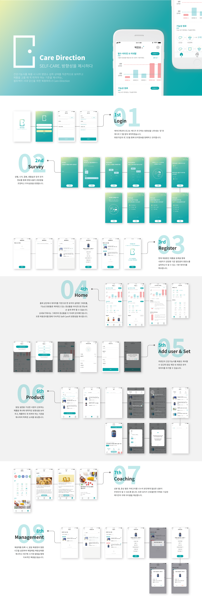

# Care-Direction

**Self Care의 방향성을 제시하다, Care Direction**

개발 기간 : 19.12.21 ~ 20.01.04




# 📚 주요 라이브러리

📕 MpAndroid Chart

```
implementation 'com.github.PhilJay:MPAndroidChart:v3.1.0'
```

그래프를 만들어 주는 라이브러리

선 그래프, 막대 그래프, 원 그래프, 분산형 차트, 캔들 스틱 차트, 버블 차트, 레이더 차트 등이 있습니다.

이 프로젝트에서는 **BarChart** 를 사용하였습니다.

[참고 자료(github)](https://github.com/PhilJay/MPAndroidChart)

📕Google Material

```
implementation 'com.google.android.material:material:1.0.0'
```

주로 cardview, recyclerview 를 커스텀하기 위해 사용합니다. 또한 버튼 탭이나 스크롤 탭, 스크롤 시 상단 탭이 없어지는 AppBar를 구현할 수 있습니다.

이 프로젝트에서는 Bottom Navigation를 사용하기 위해 라이브러리는 이용하였습니다.

[참고자료(github)](https://github.com/material-components/material-components-android)


📕CircleImageView

```
implementation 'de.hdodenhof:circleimageview:3.0.0'
```

 imageView 를 동그랗게 커스텀하기 위해 사용하였습니다. 

이 프로젝트에서도 image view를 원형으로 처리하기 위해서 라이브러리를 이용하였습니다.

[참고자료(github)](https://github.com/hdodenhof/CircleImageView)


📕Glide

```
 implementation 'com.github.bumptech.glide:glide:4.10.0'
 annotationProcessor 'com.github.bumptech.glide:compiler:4.10.0'
```

Glide는 비디오 스틸, 이미지 및 애니메이션 GIF 가져 오기, 디코딩 및 표시를 지원합니다.

기본적으로 Glide는 사용자 정의 `HttpUrlConnection`기반 스택을 사용하여 이미지를 가져오기 용이 합니다.

 이 server에서 `HttpUrlConnection`기반으로 이미지를 주고 받기 위하여 사용하였습니다.

[참고자료(github)](https://github.com/bumptech/glide)


📕DialogPlus

```
    implementation 'com.orhanobut:dialogplus:1.11@aar'
```

주로 dialog의 animation 효과를 손쉽게 쓰기 위해서 사용합니다.

이 프로젝트에서는 top dialog를 쓰기 위해서 이용하였습니다.

[참고자료(github)](https://github.com/orhanobut/dialogplus)


📕Retrofit  

```
    implementation 'com.squareup.retrofit2:retrofit:2.6.2'
    implementation 'com.squareup.retrofit2:retrofit-mock:2.6.2'
    implementation 'com.google.code.gson:gson:2.8.6'
    implementation 'com.squareup.retrofit2:converter-gson:2.6.2'
    androidTestImplementation 'androidx.test.espresso:espresso-core:3.2.0'
```

서버와 HTTP 규약을 통해 데이터를 주고 받을 수 있는 라이브러리 


POST,GET,PUT,DELETE 통신 매서드를 이용하여 

(request) 서버에게 JSON형식으로 데이터를 주고

(response) 서버 DB의 데이터를 가져올 수 있습니다.

이 프로젝트에서는 JSON 데이터를 이용한 rest 서버 통신을 위해 call 객체를 사용하였다.

[참고자료(공식 홈페이지)](https://square.github.io/retrofit/)


# 💡 핵심 기술

### 🔍 **Graph**

**뷰 기능 :** 설문조사에 따른 데이터를 기반으로 한 유저의 섭취량 그래프를 직관적으로 볼 수 있게 하므로서 손 쉽게 파악할 수 있습니다. 직관적인 그래프를 통한 Self-Care의 방향성을 제시합니다.

​	**💡Filter**  필수 비타민 & 미네랄에 대한 정보를 섭취량을 기준으로 이름순,  낮은 순,  높은 순 정렬

​	**💡animation** 

​	**💡color classification** 상한 섭취량과 권장 섭취량을 기준으로  color classification

###### :bar_chart:Barchart

**xAxis**

```
    val xAxis = chart_home.xAxis
    xAxis.position = XAxis.XAxisPosition.BOTTOM
    xAxis.granularity = 1f // 라벨 써주는 간격 조정
    
    xAxis.setDrawGridLines(false)
    xAxis.setDrawAxisLine(false)//뒤에 선 지우자
```

  xAxis.setDrawLabels(false)//이것이 바로 라벨을 지워주는 친구 ex) 비타민 D 같은 것들

**yAxis -axisLeft , axisRight**

```
	val rightYAxis = chart_home.axisRight
	rightYAxis.isEnabled = false //오른쪽 y축 사용 해제
	
	 val leftYAxis = chart_home.axisLeft
     leftYAxis.setAxisMaximum(120f)
     leftYAxis.setAxisMinimum(0f)
     leftYAxis.granularity = 20f //라벨 써주는 간격 조정
     leftYAxis.setDrawLabels(false) 
     leftYAxis.setDrawGridLines(false)
     leftYAxis.setDrawAxisLine(false)
```

y축은 왼쪽 오른쪽이 있기때문에 활성화에 대한 여부를 결정해야한다.

rightYAxis.isEnabled = false 를 하지않으면 

   leftYAxis.setDrawLabels(false) 
   leftYAxis.setDrawGridLines(false)
   leftYAxis.setDrawAxisLine(false)    를 해도 뒤에 선이 없어지지 않는다.

**LimitLine**

```
        val ll1 = LimitLine(100f, "")//선을 그려줄 위치,라벨이름
        ll1.lineWidth = 3f //선의 굵기
        ll1.enableDashedLine(50f, 20f, 0f)
        //ll1.enableDashedLine(선의 길이, 선사이의 공간, 0f)
        ll1.labelPosition = LimitLine.LimitLabelPosition.LEFT_TOP
        //라벨의 위치
        ll1.lineColor = ContextCompat.getColor(context!!, R.color.colorRed)
        //상한선의 색 설정
        ll1.textSize = 10f
        //라벨의 폰트사이즈
```


```
 chart_home.setVisibleXRange(3f, 6f) // X에 그려줄 최소, 최대 단위 정하기
```

최대 한 뷰에서 6개 bar를 그려준다


**formatter를 통해 라벨 설정**

```
		val formatter = object : ValueFormatter() {
            override fun getAxisLabel(value: Float, axis: AxisBase?): String {
				return xLabelIngredients[value.toInt()]
            }
        }
```

xLabelIngredients 성분을 custom으로 라벨링 하기 위해서 formatter 사용 


**그래프 색상 설정**

```
	val dataSet = BarDataSet(listData, "") //그래프에 그려줄 데이터 설정
    val listColor = ArrayList<Int>()
	listColor.add(ContextCompat.getColor(context!!,R.color.colorRedGraph))
	listColor.add(ContextCompat.getColor(context!!,R.color.colorBlueGraph))
    dataSet.colors = listColor // 그래프에 두가지 색으로 설정 
```

 color classification - 상한 섭취향이상과  권장 섭취량 이하는 colorRed로  사이값은 colorBlue 

**정렬**

```
	   //순서 선택정렬
       var temp = listData2[i].y
       listData2[i].y = listData2[min].y
       listData2[min].y = temp
       //매칭되어있는 라벨도 함께 이동
       var tempX = xLabelIngredients2[i]
       xLabelIngredients2[i] = xLabelIngredients2[min]
       xLabelIngredients2[min] = tempX
```

 이름순, 낮은 순, 높은 순 spinner로 선택할떄마다 정렬을 다시해줌 

**animate**

```
chart_home.animateY(1000) //세로축 에니메이션
```


### 🔍 설문조사

**뷰 기능 :**  성별,나이,질병,생활습관 등의 유저정보를 통해 영양소들의 권장량을 조정하고 주의성분을 반영합니다.

- 설문조사 ‘이어하기’ 기능을 위한 정보 저장 및 뷰 이동을 SharedPreferences와 Intent,렌더링액티비티를 통해 구현. 

> \- SharedPreferences를 이용하여 설문조사 정보를 뷰 단위로 저장.
> 설문을 마치지 않은 채로 종료한 뒤 재접속 시, 렌더링액티비티를 이용하여 설문 진행도를(저장된 유효 정보 판단) 파악.
> \- 유효한 정보가 없는 즉, 설문을 이어서 진행할 뷰까지 Intent list를 통해 이동.


### 🔍 제품 기준 확인 및 검색 기능

**뷰 기능 :** 영양제 제품이 포함하는 성분 중, 사용자가 따져봐야 하는 주요 특정 성분3가지를 제시함으로서 직관적으로 사용자가 자신에게 맞는 영양제를 찾을 수 있다.

-  해당 뷰는 리사이클러뷰를 클릭하면, 해당 item의 check와 상단 3가지 기준이 바뀝니다.

- 이를 구현하기 위해, bind함수 내에서 아이템 뷰가 클릭되면 리사이클러뷰 data배열 전체를 false로 초기화 시켜준 다음, 클릭된 해당 data배열을 ture초기화 시켜주었습니다.

  


# Naming Rule

* ## View id값

  * 버튼 : btn_
  * 텍스트뷰 : txt_~
  * 이미지뷰 : img_~
  * 에디트텍스트 : edit
  * RecyclerView : rv_~_
  * RecyclerView item.xml : rv_item_feature.xml
  * View in RecyclerView item.xml: view_rv_item_feature_component <br> ex)txt_rv_item_shopping_product_name

  

* ## Border 

  * ### radius

    기본 틀 : color_border_form

    * 6dp  -> color_border_square / gray_boder_lineㅜ
    * 10dp -> color_border_long
    * 18dp -> white_border_fill / white_border_line
    * 23dp -> color_border

* ## Package 분류

  * home  
    필수 비타민&미네랄 -권장 섭취량과 상한 섭취량에 대한 그래프를 보여줌  
    기능성 원료- 케어받는 기능 표시  
    복용관리 – 복용하고 있는 제품에 대한 관리<br>
    * functional : 기능성 원료 - 케어받는 기능 표시 
  * product  
    영양제 제품에 대한 정보와 해당 제품에 대한 기준을 제시하여, 제품을 보고 자신에게 맞는 영양제를 직관적으로 알 수 있는 페이지.  
    * Detail : 제품 상세페이지에 대한 모든 정보가 들어있는 코드   
    * Search : Fragment 제품 탭으로, 제품 검색과 제품 기준 뷰로 넘어갈 수 있는 코드  
    * Standard : 제품에 성분 대한 정보를 직관적으로 알 수 있게 제품의 정보를 기준으로 한눈에 볼 수 있는 뷰

  * research  
    사용자의 정보(userInfo)와 유형(lifestyle)을 파악하기 위한 설문조사 기능 구현
    * DB : 설문조사 '이어하기'를 위한 내부저장소 및 해당 액티비티로의 이동과 렌더링을 관리
    * lifestyle : 사용자 유형에 대한 설문조사를 진행(케디만의 생활패턴 관련 질문)
    * userInfo : 사용자 정보에 대한 설문조사를 진행(일반적인 사용자 정보 관련 질문)

  

  ## Constraintlayout 사용

  **Relative positioning **

  **대부분의 뷰가 Constraintlayout으로 요소 간 상대 위치를 지정하여 구성하였습니다.**

  - **Chain Type** : **Spread Chain 속성을 사용하여 서로의 간격이 일정하도록 유지되게 하였습니다.**

  ```
  <androidx.cardview.widget.CardView
   android:id="@+id/cardview_activity_product_detail"
   android:layout_width="98dp"
   android:layout_height="69dp"
   android:outlineAmbientShadowColor="@color/colorBlack"
   app:cardCornerRadius="15dp"
   app:cardElevation="16dp"
   app:layout_constraintBottom_toBottomOf="parent"
   app:layout_constraintEnd_toStartOf="@id/cardview_activity_product_detail_txt"
   app:layout_constraintHorizontal_chainStyle="spread"
   app:layout_constraintStart_toStartOf="parent"
   app:layout_constraintTop_toTopOf="parent"> <TextView
     android:id="@+id/txt_activity_product_detail_content"
     android:layout_width="wrap_content"
     android:layout_height="wrap_content"
     android:layout_gravity="center_horizontal"
     android:layout_marginTop="11dp"
     android:fontFamily="@font/notosanskr_medium"
     android:includeFontPadding="false"
     android:letterSpacing="-0.02"
     android:lineSpacingExtra="9sp"
     android:text="11000mg"
     android:textColor="#00a5a8"
     android:textSize="18sp" />
  ```

  …
  app:layout_constraintHorizontal_chainStyle="spread"

  

  ## lambda 사용

  Listener, forEach, let 등을 구현하는데 있어 간결한 표현과 편리한 이용을 위해 람다식을 사용하였다.

  - 리스너 (setOnClickLisetener, setOnCheckedChangeListener)

  ```
  btn_name_next?.setOnClickListener{
        val name = edt_username?.text.toString()      keeper.name = name      val gender_intent = Intent(this,ResearchGenderActivity::class.java)
        startActivity(gender_intent)
     }
  rg_alcohol_1.setOnCheckedChangeListener { radioGroup, i ->
        keeper.cigarette = i
        radioGroup.checkedRadioButtonId.toString().logDebug()
        check1 = true
     }
  ```

  - forEach , forEachIndexed

  ```
  if(btn_disease_clear.isChecked){
          checkBtnColor(btn_disease_clear,true)
          disButtons.forEach {
            checkBtnColor(it,false)
         }
       }
  disButtons.forEachIndexed { index, checkBox ->
        disButtons[index].setOnClickListener{
          if (disButtons[index].isChecked) {
            checkBtnColor(disButtons[index], true)
            checkBtnColor(btn_disease_clear, false)
         } else {
            checkBtnColor(disButtons[index], false)
         }
          checkSelectButton()
       }
     }
  ```

  -  let, filter, fun

  ```
  disButtons
         .filter { it.isChecked }
         .forEach { set.add(it.text.toString()) }
        if(btn_disease_clear.isChecked) set.add(btn_disease_clear.text.toString())
        keeper.disease = set
  keeper.run {
        intents.add(Intent(this@ResearchActivity, ResearchNameActivity::class.java))
        if (name == null) return@run
  }
  ```

  

  ## extension function 사용

  자주 쓰이는 Log와 Toast를 확장 함수를 통해 간략한 표현법으로 정의하여 이용에 편리성을 높였다.

  - Log

  ```
  private const val TAG = "cadi"fun String.logDebug() {
    Log.d(TAG, this)
  }fun String.logError() {
    Log.e(TAG, this)
  }fun String.logWarn() {
    Log.w(TAG, this)
  }
  ```

  -  Toast

  ```
  fun Context.toast(msg: String) {
    Toast.makeText(this, msg, Toast.LENGTH_SHORT).show()
  }fun Context.toastLong(msg: String) {
    Toast.makeText(this, msg, Toast.LENGTH_LONG).show()
  }
  ```

  

  ## 개발자

  - **정은이** - [EuneeChung](https://github.com/EuneeChung)
  - **조충범** - [cndqjacndqja](https://github.com/cndqjacndqja)
  - **천명희** - [Haeeul](https://github.com/Haeeul)

  ## Git 사용시 주의사항

  * master 브랜치에 올리기 전에 deve 브랜치에서 먼저 합치기
